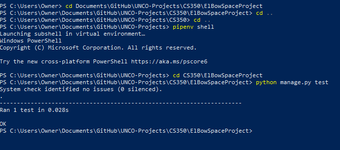
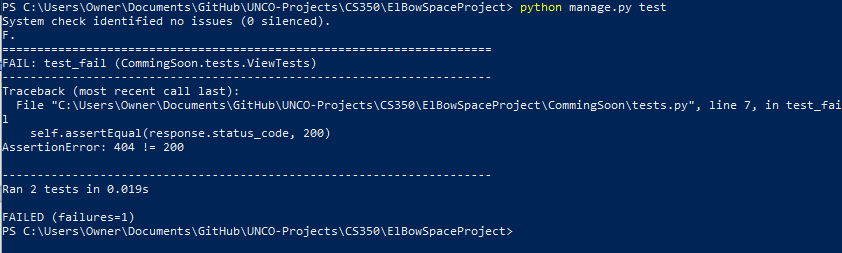

Testing
Django is nice in how it understands and reacts to testing capabilities; and while it may be a bit difficult to get started, providing that you have the virtual environment enabled you should find it not so difficult!

After you’re in the virtual environment:

Navigate through the command ‘cd (folder_name)’ to the folder that has the manage.py command. From there, in console, type python manage.py test

Then,  it will execute whatever tests are present in the  tests.py file!

Where is this file located?

Open up the ‘CommingSoon’ folder and there we are!

Opening up the tests file will demonstrate a very limited amount of code. Don’t be worried about things failing while executing the test code – even if something fails, it will still continue with the code!

 
Pretty darn simple! What this is saying is that whatever the ‘response’ is for the main page, IE, the page that has no additional content behind https://elbeauspace.pythonanywhere.com/, to be tested. If it provides a successful code – that is, 200! - then the webpage is displaying properly. If it was getting a 404 though, then it would say that it failed the test. Let’s edit this a little bit, just to show that things work even if things aren’t perfect!
 

Now let’s see what happens in the environment.
Uh-oh! Why is it only saying that one test was run?

 
Let’s look back at the document. What’s the difference between the two tests? 

Hm, it seems that there’s a difference in the naming conventions! Let’s change ‘fail_test’ to ‘test_fail’, because all tests **NEED** to start with test in front, or else they’re ignored by the command!

 
Much better!

Now, let’s take a look and see what happens when we run the tests.

SUCCESS. More correctly, success in failure! There is no page named ‘hello’ and as a result, it provides a 404, resulting in the assertion being that we would have 200 be wrong. Good job!

That’s it for Week 3 Testing! 
